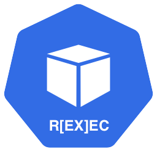

# kubectl-rexec

Kubectl exec does not provide any kind of audit what is actually done inside the container. Rexec plugin is here to help with that.

## Contributing
We strongly encourage you to contribute to our repository. Find out more in our [contribution guidelines](https://github.com/Adyen/.github/blob/main/CONTRIBUTING.md)

## Compatibility
TTY session auditing supports both **WebSocket** and **SPDY** exec streaming protocols. WebSocket is the default on Kubernetes 1.30+ (`TranslateStreamCloseWebsocketRequests` feature gate). On older clusters where kubectl still uses SPDY (for example Kubernetes 1.29 without that feature gate enabled), rexec audits keystrokes from SPDY stdin streams as well.

## Installation
See the [Getting started](https://github.com/Adyen/kubectl-rexec/blob/main/STARTED.md) guide.

## Usage
See the [Getting started](https://github.com/Adyen/kubectl-rexec/blob/main/STARTED.md) guide.

## Testing
Tests are currently implemented for the rexec/server

Run the tests like:
`go test ./rexec/server`
`go test ./plugin`

## Documentation
See the [Design](https://github.com/Adyen/kubectl-rexec/blob/main/DESIGN.md).

## Support
If you have a feature request, or spotted a bug or a technical problem, create a GitHub issue.

## License    
MIT license. For more information, see the LICENSE file.